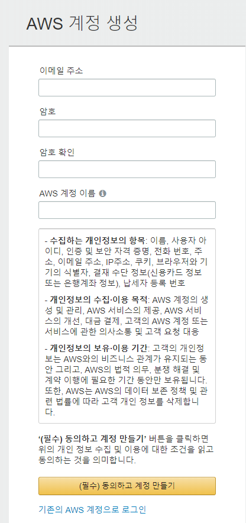

# Backend Tool


* cognito - 사용자 풀 관리 서비스(인증 구현 서비스)
* cloudfront - 정,동적 웹 콘텐츠를 사용자에게 더 빨리 배포하게 해주는 웹 서비스
* Amazon S3(Simple Storage Service) - 확장성과 데이터 가용성 및 보안과 성능을 제공하는 객체 스토리지 서비스
* DB - DynamoDB
* AWS Lambda
* AWS api-gateway
* Amazon IAM(Identity and Access Management) - AWS 리소스에 대한 액세스를 안전하게 제어할 수 있는 웹 서비스. 

# Frontend Tool


* aws-amplify (api, auth, storage)
* bootstrap-vue, bootstrap
* moment
* vue, vuex, vue/cli
* eslint, babel, prettier
* aws-serverless


# 개발 진행 과정 - Backend 

## **AWS 계정 세팅**

### AWS 계정 생성

- [AWS 홈페이지](https://aws.amazon.com/)에서 AWS의 계정을 생성한다.



### IAM 사용자 생성

- Amazon IAM을 사용하여 AWS의 사용자와 사용자 권한을 관리할 수 있다.
- [AWS 콘솔](https://console.aws.amazon.com/)에 로그인하여 서비스 목록 중 IAM을 선택한다.
- 
- AWS IAM 카테고리 -> 사용자 항목 -> 사용자 추가 항목 으로 들어가 세부 내역 작성. 정책 설정
- 
- 정책 직접 연결 선택, **AdministratorAccess**를 검색해서 정책을 선택한 후 다음:태그를 누르고 다음:검토를 누른다
- 
- 
  - (AdministratorAccess) 후 유저 생성하면 접근 키 주소가 나온다.
  - Secret access key 와 access key 는 앞으로 식별 값으로 사용하기 때문에 따로 적어둬야 한다.
  - 
- IAM을 사용하여 유저간 권한,정책 설정을 수월하게 할 수 있다.
- ARN (Amazon Resource Name) - AWS 리소스를 고유하게 식별한다. 
- IAM 정책, Amazon Relational Database Service(Amazon RDS) 태그 및 API 호출과 같은 모든 AWS에서 리소스를 명료하게 지정해야 하는 경우 ARN이 필요


### AWS CLI 설정 

- AWS의 서비스를 쉽게 사용하기 위해 AWS CLI를 설치 한다.
- AWS CLI는 Python 2.6.5+ 또는 Python 3.3+와 Pip이 필요하다.
- Pip 실행 후 다음 명령어로 설치할 수 있다.

```powershell
pip install awscli
```


#### AWS CLI 사용자 액세스 키 추가하기

- IAM 사용자 생성으로 만들어진 액세스키와 보안 액세스키를 다음 실행 후 입력 해준다

  ```powershell
  aws configure
  ```


## DynamoDB 테이블 생성하기

DynamoDB는 NoSQL 데이터베이스로 빠르고 예측가능한 성능을 제공한다.

### 테이블 생성하기

-  [AWS 콘솔](https://console.aws.amazon.com/)에 로그인 후 서비스 목록에서 DynamoDB를 선택한다.
-  
- 이후 테이블 만들기를 선택, 테이블 이름을 입력하고 생성하고 싶은 정보를 입력한다.
- 각 DynamoDB 테이블에는 기본기가 있으며 두종류의 다른 기본 키를 지원한다.
  - 파티션 키
  - 파티션 키와 정렬 키(복합)
- 테이블 설정 항목의 기본 설정 사용 체크를 해제하고 할당됨 체크를 온디멘드로 변경해주고 생성한다.
- 

### 파일 업로드를 위한 S3 Bucket 생성하기

Amazon S3는 REST같은 서비스 인터페이스를 통해 저장 서비스를 제공한다. 


#### Bucket 생성하기

- 먼저  [AWS 콘솔](https://console.aws.amazon.com/)에 로그인하고 서비스 목록에서 **S3**를 선택한다.
- 
- **버킷 만들기**를 선택
- 버킷의 제목을 입력하고 지역을 선택(아시아 태평양(서울)로 기본 선택 되어있음)
- 

버킷 이름과 리전은 나중에 사용하기 때문에 따로 적어 두도록 한다.

다른 항목들은 모두 기본 설정으로 남겨놓고 버킷 만들기를 클릭.


#### CORS 활성화하기

제작할 앱에서 방금 만든 버킷에 파일을 업로드한다. 그리고 앱은 커스텀 도메인을 통해 제공 될 것이기 때문에 업로드를 하는 동안은 도메인간의 연결을 해야한다. 하지만 S3는 다른 도메인에서 리소스에 액세스하는 것을 허용하지 않기 때문에 CORS(Cross-Origin Resource Sharing)을 통해 한 도메인에 등록된 클라이언트 프로그램이 다른 도메인의 리소스와 상호 작용할 수 있는 방법을 정의할 수 있다.

- 방금 생성한 버킷을 선택한다.
- **권한** 탭을 선택 후, **CORS 구성**을 클릭한다.
- 
- **CORS 구성** 편집기에 아래 내용을 추가하고 저장 버튼을 클릭한다.

```html
<CORSConfiguration>
	<CORSRule>
		<AllowedOrigin>*</AllowedOrigin>
		<AllowedMethod>GET</AllowedMethod>
		<AllowedMethod>PUT</AllowedMethod>
		<AllowedMethod>POST</AllowedMethod>
		<AllowedMethod>HEAD</AllowedMethod>
		<AllowedMethod>DELETE</AllowedMethod>
		<MaxAgeSeconds>3000</MaxAgeSeconds>
		<AllowedHeader>*</AllowedHeader>
	</CORSRule>
</CORSConfiguration>
```

- 

운영 환경에서 사용할 때에는 도메인이나 도메인 목록을 사용해서 구성 할 수 있다.


## Cognito 유저 풀 생성하기

 Amazon Cognito 유저 풀을 사용하면 개발자가 애플리케이션에 등록 및 로그인 기능을 쉽게 추가 할 수 있다.

사용자 고유한 uuid를 제공, 로그인을 지원하며 사용자의 인증 토큰을 프로비저닝 한다.


### 사용자 풀 만들기

- [AWS 콘솔](https://console.aws.amazon.com/)의 서비스 목록에서 Cognito를 선택

- 

- **사용자 풀 관리**를 클릭한다.

- **사용자 풀 생성**을 클릭한다.

- **풀 이름**을 입력하고 **기본값 검토**를 클릭한다.

- 

- 설정은 사용자가 필요한 속성과 항목에 따라 변경해주고 최종적으로 풀 생성을 클릭해 사용자 풀을 생성한다.

- 

  

- 생성된 풀 ID와 풀 ARN, 리전 값은 나중에 사용해야 하므로 따로 적어놓는다

- 


### 앱 클라이언트 만들기

- 유저풀 메뉴 왼쪽 패널에서 앱 클라이언트 선택
- 
- 앱 클라이언트 추가를 누르고 앱 클라이언트 이름을 입력, 클라이언트 보안키 생성은 체크 해제후 서버기반 인증용 로그인 API 활성화를 선택하고 앱 클라이언트를 생성한다.
- 
- 생성된 앱 클라이언트 ID는 적어둔다.
- 


### 도메인 이름 만들기

- 메뉴 왼쪽 패널에서 도메인 이름 선택
- 도메인 이름을 입력하고 변경내용을 저장한다.
- 

## Cognito 테스트 유저 생성하기


### 사용자 만들기

- AWS CLI를 사용해서 사용자를 등록한다. 사이트의 메뉴를 통해서도 생성이 가능하다.

- 터미널에서 실행한다.

  ```powershell
  aws cognito-idp sign-up
  --region 등록된 리전
  --client-id 앱 클라이언트 ID
  --username 사용할 Email 주소
  --password 비밀번호
  ```

- 생성된 사용자는 인증을 받기전에 확인을 거쳐야 한다. 터미널에서 실행한다.

  ```powershell
  aws cognito-idp admin-confirm-sign-up
  --region 등록된 리전
  --user-pool-id Cognito 유저 풀 ID
  --username 등록한 Email 주소	
  ```

  

## Serverless 프레임워크 세팅하기

 백엔드를 만들기 위해 AWS Lambda와 Amazon API Gateway를 사용할 것이다. 하지만 이 두가지를 직접 구성하는 것은 번거롭기 때문에 서버리스 프레임워크를 사용할 것이다.


### Serverless 설치하기

- Serverless를 설치한다

  ```powershell
  npm install serverless -g
  ```

- github에 있는 serverless 스타터의 소스를 받아 신규 프로젝트를 생성한다.

  ```powershell
  serverless install --url https://github.com/AnomalyInnovations/serverless-nodejs-starter --name mlog-app-api
  ```

- 생성된 프로젝트 디렉토리엔 아래 파일들이 존재하는데 각각

  - handler.js - AWS Lambda에 배포 될 서비스/기능의 코드가 들어있음
  - serverless.yml - Serverless가 제공 할 AWS 서비스 구성이 포함되어 있음

- 생성된 프로젝트의 package.json의 목록에 있는 라이브러리 패키지를 설치한다

  ```powershell
  npm install
  ```

- 백엔드를 위해 두가지 패키지를 추가로 설치한다

  ```powershell
  npm install aws-sdk
  npm install uuid
  ```

  - aws-sdk - AWS 서비스와 통신이 가능해진다
  - uuid - 고유ID를 생성해주어 주로 DynamoDB의 키값을 저장하는데 필요하다


### ES6/ES7 자바스크립트를 위한 추가 설정

 핸들러 함수에서 ES import/export를 사용하게 되는데 이를 위해 Babel과 Webpack 4를 사용해 패키지를 최적화 시킬 것이다. 이것을 자동으로 수행하게 해주는 serverless-bundle플러그인을 사용할 것이다. 

serverless.yml의 내용을 아래의 기본값으로 설정한다

```yaml
service: mlog-app-api

package:
  indivitually: true

plugins:
  - serverless-bundle
  - serverless-offline

provider:
  name: aws
  runtime: nodejs(사용할 버전)
  stage: prod
  region: 등록한 리전
```


### 공통 코드 작성

#### 함수 추가하기 (코드 리팩토링)

다양한 API를 사용하기 전 공통으로 사용되는 부분을 작성한다.

- 프로젝트 루트에서 libs 디렉토리 생성

- response-lib.js 파일을 생성한다.

  ```javascript
  export function success(body) {
    return buildResponse(200, body);
  }
  
  export function failure(body) {
    return buildResponse(500, body);
  }
  
  function buildResponse(statusCode, body) {
    return {
      statusCode: statusCode,
      headers: {
        "Access-Control-Allow-Origin": "*",
        "Access-Control-Allow-Credentials": true
      },
      body: JSON.stringify(body)
    };
  }
  ```

  이것으로 http상태코드와 헤더사용으로 성공, 실패의 응답처리를 할 수 있게 된다.

- libs 디렉토리에 dynamodb-lib.js 파일을 생성한다.

  ```javascript
  import AWS from "aws-sdk";
  
  export function call(action, params) {
    const dynamoDb = new AWS.DynamoDB.DocumentClient();
  
    return dynamoDb[action](params).promise();
  }
  ```

  dynamoDb 메소드는 promise 형식을 사용하여 비동기코드로 콜백을 받게 된다.

  

### 노트 생성 API 만들기

- 프로젝트 디렉토리에 create.js 파일을 생성하여 다음과 같이 작성한다.

```javascript
import uuid from "uuid";
import * as dynamoDbLib from "./libs/dynamodb-lib";
import { success, failure } from "./libs/response-lib";

export async function main(event, context) {
  const data = JSON.parse(event.body);
  const params = {
    TableName: "notes",
    Item: {
      userId: event.requestContext.identity.cognitoIdentityId,
      noteId: uuid.v1(),
      content: data.content,
      attachment: data.attachment,
      createdAt: Date.now()
    }
  };

  try {
    await dynamoDbLib.call("put", params);
    return success(params.Item);
  } catch (e) {
    return failure({ status: false });
  }
}
```


#### API 엔드포인트 구성

생성한 함수에 API 엔드포인트를 설정한다

- serverless.yml파일에 아래 코드를 추가한다

```javascript
# serverless-webpack 구성 
# 외부 모듈 패키징 자동화 활성
custom:
  webpack:
    webpackConfig: ./webpack.config.js
    includeModules: true

#provide 항목에 아래 항목을 추가한다.
  # 'iamRoleStatements' Lambda 함수를 위한 권한 정책 정의
  # Lmabda 함수에 DynamoDB 액세스 권한을 설정합니다.
  iamRoleStatements:
    - Effect: Allow
      Action:
        - dynamodb:DescribeTable
        - dynamodb:Query
        - dynamodb:Scan
        - dynamodb:GetItem
        - dynamodb:PutItem
        - dynamodb:UpdateItem
        - dynamodb:DeleteItem
      Resource: "arn:aws:dynamodb:등록한 리전:*:*"

functions:
  # create.js의 메인 함수를 호출하는 HTTP API 엔드포인트를 정의
  # - path: url 경로는 /notes
  # - method: POST 요청
  # - cors: 브라우저의 크로스 도메인 API 호출을 위해 CORS (Cross-Origin Resource Sharing) 활성화 
  # - authorizer: AWS IAM 역할을 통한 인증 
  create:
    handler: create.main
    events:
      - http:
          path: notes
          method: post
          cors: true
          authorizer: aws_iam
```


####  테스트

생성한 API를 테스트하기 위해 create-event.json 파일을 생성한다.

```
{
  "body": "{\"content\":\"hello world\",\"attachment\":\"hello.jpg\"}",
  "requestContext": {
    "identity": {
      "cognitoIdentityId": "USER"
    }
  }
}
```

우리가 생성한 필드의 값을 세팅해 직접 serverless 명령어를 실행 해본다.

```powershell
serverless invoke local --function create --path create-event.json	
```

실행한 코드의 statusCode의 결과값이 200이 나오면 정상 실행 된것이다.

여기서 생성된 noteId값은 이후 수정, 삭제 테스트시 사용되니 따로 적어둔다.


### 노트 정보 불러오는 API  만들기

 noteId 값으로 노트 정보를 불러오는 API를 추가한다.

- get.js를 생성한다.

  ```javascript
  import * as dynamoDbLib from "./libs/dynamodb-lib";
  import { success, failure } from "./libs/response-lib";
  
  export async function main(event, context) {
    const params = {
      TableName: "notes",
  	 // 'Key'는 검색 할 항목의 파티션 키와 정렬 키를 정의한다.
       // - 'userId': 인증 된 사용자의 ID 풀에 해당하는 인증 아이디
       // - 'noteId': 경로 매개 변수
      Key: {
        userId: event.requestContext.identity.cognitoIdentityId,
        noteId: event.pathParameters.id
      }
    };
  
    try {
      const result = await dynamoDbLib.call("get", params);
      if (result.Item) {
  	  // 불러온 아이템을 반환한다.
        return success(result.Item);
      } else {
        return failure({ status: false, error: "Item not found." });
      }
    } catch (e) {
      return failure({ status: false });
    }
  }
  ```


#### API 엔드포인트 구성

생성한 api의 엔드포인트를 추가한다.

```javascript
get:
    #  get.js의 main 함수를 호출하는 HTTP API 엔드포인트를 정의한다.
    # - path: /notes/{id} url 경로
    # - method: GET 요청 
    handler: get.main
    events:
      - http:
          path: notes/{id}
          method: get
          cors: true
          authorizer: aws_iam
```


#### 테스트

생성한 api의 테스트를 위해 get-event.json파일을 생성한다.

```javascript
{
  "pathParameters": {
    "id": "생성 api에서 나온 id 값"
  },
  "requestContext": {
    "identity": {
      "cognitoIdentityId": "USER"
    }
  }
}
```

작성 후 터미널에서 다음 명령어를 실행한다.

```powershell
serverless invoke local --function get --path get-event.json
```

실행 후 나온 statusCode가 200이 나와야 한다.


### 모든 노트목록 불러오는 API 만들기

사용자가 가진 모든 노트를 불러오는 API를 추가한다.

- list.js 파일을 생성한다.

```javascript
import * as dynamoDbLib from "./libs/dynamodb-lib";
import { success, failure } from "./libs/response-lib";

export async function main(event, context) {
  const params = {
    TableName: "notes",
    // 'KeyConditionExpression' 조건을 가진 쿼리를 정의한다.
    // - 'userId = :userId': 파티션 키인  'userId' 값과 같은 데이터를 반환하도록 한다.
    // 'ExpressionAttributeValues' 조건 값을 정의한다.
    // - ':userId': 'userId' 값을 사용자 인증을 완료한 Cognito Identity Pool의 인증 ID
    //   를 정의한다. 
    KeyConditionExpression: "userId = :userId",
    ExpressionAttributeValues: {
      ":userId": event.requestContext.identity.cognitoIdentityId
    }
  };

  try {
    const result = await dynamoDbLib.call("query", params);
    // 응답 본문에 일치하는 아이템의 목록을 반환한다.
    return success(result.Items);
  } catch (e) {
    return failure({ status: false });
  }
}
```


#### API 엔드포인트 구성

생성한 api의 엔드포인트를 추가한다.

```javascript
list:
    # list.js의 메인 함수를 호출하는 HTTP API 엔드포인트를 정의한다. 
    # - path: url 경로는 /notes
    # - method: GET 요청 
    handler: list.main
    events:
      - http:
          path: notes
          method: get
          cors: true
          authorizer: aws_iam
```


#### 테스트

생성한 api의 테스트를 위해 get-event.json파일을 생성한다.

```javascript
{
  "requestContext": {
    "identity": {
      "cognitoIdentityId": "USER"
    }
  }
}
```

작성 후 터미널에서 다음 명령어를 실행한다.

```powershell
serverless invoke local --function list --path list-event.json
```

실행 후 나온 statusCode가 200이 나와야 한다.


### 노트를 수정하는 API 만들기

 noteId를 사용하여 노트의 정보를 변경할 수 있는 API를 생성한다.

- update.js를 생성한다.

```javascript
import * as dynamoDbLib from "./libs/dynamodb-lib";
import { success, failure } from "./libs/response-lib";

export async function main(event, context) {
  const data = JSON.parse(event.body);
  const params = {
    TableName: "notes",
    // 'Key' 수정하고자 하는 아이템의 파티션 키와 정렬 키를 정의한다.
    // - 'userId': 인증된 사용자의 Cognito Identity Pool의 인증 ID
    // - 'noteId': 경로 파라미터 
    Key: {
      userId: event.requestContext.identity.cognitoIdentityId,
      noteId: event.pathParameters.id
    },
    // 'UpdateExpression' 업데이트 될 속성을 정의한다.
    // 'ExpressionAttributeValues' 업데이트 표현식의 값을 정의한다.
    UpdateExpression: "SET content = :content, attachment = :attachment",
    ExpressionAttributeValues: {
      ":attachment": data.attachment || null,
      ":content": data.content || null
    },
    // 'ReturnValues' 아이템 속성을 반환할지 여부와 방법을 지정한다.
    // 여기서 ALL_NEW는 업데이트 후 항목의 모든 속성을 반환한다.
    // 아래에서 '결과값'을 검사하여 다른 설정에서 작동하는 방식을 확인할 수 있다.
    ReturnValues: "ALL_NEW"
  };

  try {
    const result = await dynamoDbLib.call("update", params);
    return success({ status: true });
  } catch (e) {
    return failure({ status: false });
  }
}
```


#### API 엔드포인트 구성

생성한 api의 엔드포인트를 추가한다.

```javascript
update:
    # update.js의 메인 함수를 호출하는 HTTP API 엔드포인트를 정의한다.
    # - path: url 경로는 /notes/{id} 이다.
    # - method: PUT 요청 
    handler: update.main
    events:
      - http:
          path: notes/{id}
          method: put
          cors: true
          authorizer: aws_iam
```


#### 테스트

생성한 api의 테스트를 위해 update-event.json파일을 생성한다.

```javascript
{
  "body": "{\"content\":\"new world\",\"attachment\":\"new.jpg\"}",
  "pathParameters": {
    "id": "적어두었던 noteId"
  },
  "requestContext": {
    "identity": {
      "cognitoIdentityId": "USER"
    }
  }
}
```

작성 후 터미널에서 다음 명령어를 실행한다.

```powershell
serverless invoke local --function update --path update-event.json
```

실행 후 나온 statusCode가 200이 나와야 한다.


### 노트를 삭제하는 API 만들기

 특정 노트를 삭제할 수 있는 API를 생성한다.

- delete.js를 생성한다.

```javascript
import * as dynamoDbLib from "./libs/dynamodb-lib";
import { success, failure } from "./libs/response-lib";

export async function main(event, context) {
  const params = {
    TableName: "notes",
    // 'Key' 삭제할 아이템의 파티션 키와 정렬 키를 정의한다다.
    // - 'userId': 인증 사용자의 Cognito Identity Pool 인증 ID 
    // - 'noteId': 경로 파라미터
    Key: {
      userId: event.requestContext.identity.cognitoIdentityId,
      noteId: event.pathParameters.id
    }
  };

  try {
    const result = await dynamoDbLib.call("delete", params);
    return success({ status: true });
  } catch (e) {
    return failure({ status: false });
  }
}
```


#### API 엔드포인트 구성

생성한 api의 엔드포인트를 추가한다.

```javascript
delete:
    # delete.js의 메인 함수를 호출하는 HTTP API 엔드포인트
    # - path: url 경로는 /notes/{id} 이다.
    # - method: DELETE 요청 
    handler: delete.main
    events:
      - http:
          path: notes/{id}
          method: delete
          cors: true
          authorizer: aws_iam
```


#### 테스트

생성한 api의 테스트를 위해 delete-event.json파일을 생성한다.

```javascript
{
  "pathParameters": {
    "id": "적어두었던 noteId"
  },
  "requestContext": {
    "identity": {
      "cognitoIdentityId": "USER"
    }
  }
}
```

작성 후 터미널에서 다음 명령어를 실행한다.

```powershell
serverless invoke local --function delete --path delete-event.json
```

실행 후 나온 statusCode가 200이 나와야 한다.


### API Gateway CORS 에러 핸들링

 HTTP오류가 생길시 디버깅하기 힘들기 때문에 CORS헤더를 API Gateway 오류에 추가하는 설정을 해줘야 한다. 

루트 디렉토리에 resources폴더를 생성 후 api-gateway-errors.yml을 추가한다

```yaml
Resources:
  GatewayResponseDefault4XX:
    Type: 'AWS::ApiGateway::GatewayResponse'
    Properties:
      ResponseParameters:
         gatewayresponse.header.Access-Control-Allow-Origin: "'*'"
         gatewayresponse.header.Access-Control-Allow-Headers: "'*'"
      ResponseType: DEFAULT_4XX
      RestApiId:
        Ref: 'ApiGatewayRestApi'
  GatewayResponseDefault5XX:
    Type: 'AWS::ApiGateway::GatewayResponse'
    Properties:
      ResponseParameters:
         gatewayresponse.header.Access-Control-Allow-Origin: "'*'"
         gatewayresponse.header.Access-Control-Allow-Headers: "'*'"
      ResponseType: DEFAULT_5XX
      RestApiId:
        Ref: 'ApiGatewayRestApi'
```

API Gateway 4xx에러와 5xx에러를 위해 생성한다.

위의 리소스를 serverless.yml에 추가한다

```yaml
resources:
  # API Gateway 에러 
  - ${file(resources/api-gateway-errors.yml)}
```


### API 배포하기

완성된 API를 배포한다.

- 터미널에서 다음 명령어를 실행한다

```powershell
serverless deploy
```

배포가 완료되면 서비스 정보가 뜨게 되는데 다음과 같다

```powershell
Service Information
service: notes-app-api
stage: prod
region: 등록한 리전
api keys:
  None
endpoints:
  POST - https://API게이트웨이ID.execute-api.us-east-1.amazonaws.com/prod/notes
  GET - https://API게이트웨이ID.execute-api.us-east-1.amazonaws.com/prod/notes/{id}
  GET - https://API게이트웨이ID.execute-api.us-east-1.amazonaws.com/prod/notes
  PUT - https://API게이트웨이ID.execute-api.us-east-1.amazonaws.com/prod/notes/{id}
  DELETE - https://API게이트웨이ID.execute-api.us-east-1.amazonaws.com/prod/notes/{id}
functions:
  notes-app-api-prod-create
  notes-app-api-prod-get
  notes-app-api-prod-list
  notes-app-api-prod-update
  notes-app-api-prod-delete
```


### Cognito 자격 풀 생성하기

배포된 API를 다른 AWS 서비스에 액세스하기 위해 Cognito에 자격증을 만든다.

- AWS Console의 서비스 목록중 Cognito를 선택한다.

- **자격 증명 풀 관리** 선택

- 

- **새 자격 증명 풀 만들기**를 클릭

- **인증 공급자**를 선택하고 **Cognito** 탭 아래에 사용자 풀의 **사용자 풀 ID**와 **App Client ID**를 입력하고 **풀 생성**을 클릭한다.

- 

  

- 이후 자격 증명 풀에서 가져온 임시 자격 증명이 있는 사용자가 액세스할 수 있는 AWS 리소스를 지정 해야한다.

- **세부 정보 보기**를 선택하면 두 개의 **역할 요약** 섹션이 확장되어있다. 맨 위 섹션에는 인증 된 사용자의 권한 정책이 요약되어 있으며 아래 섹션에는 인증되지 않은 사용자의 권한 정책이 요약되어 있다.

  상단 섹션에서 **정책 문서 보기**를 선택하고 **편집**을 선택한다.

  

- 아래 정책을 편집화면에 추가한다. 

```javascript
{
  "Version": "2012-10-17",
  "Statement": [
    {
      "Effect": "Allow",
      "Action": [
        "mobileanalytics:PutEvents",
        "cognito-sync:*",
        "cognito-identity:*"
      ],
      "Resource": [
        "*"
      ]
    },
    {
      "Effect": "Allow",
      "Action": [
        "s3:*"
      ],
      "Resource": [
        "arn:aws:s3:::S3 버킷 이름/private/${cognito-identity.amazonaws.com:sub}/*"
      ]
    },
    {
      "Effect": "Allow",
      "Action": [
        "execute-api:Invoke"
      ],
      "Resource": [
        "arn:aws:execute-api:등록한 리전:*:API게이트웨이 ID/*/*/*"
      ]
    }
  ]
}
```

 위 정책으로 로그인 한 사용자에게 `private/${cognito-identity.amazonaws.com:sub/}/`경로에 대한 액세스 권한을 부여 한다. 여기서 `cognito-identity.amazonaws.com:sub`는 인증된 사용자의 ID로 버킷 내의 자신의 폴더에만 액세스 할 수 있게 된다.

 주의해야 할 또 한 가지는 연동 자격 증명 ID가 우리의 자격 증명 풀에서 할당된 UUID라는 점인데 이것은 API를 만들 때 사용자 ID로 사용했던 ID (`event.requestContext.identity.cognitoIdentityId`)이다.

- 설정 후 허용을 선택한다.
- 이후 자격증명 풀을 선택해야하는데 왼쪽 패널에서 대시보드를 선택한 다음 화면 우측 상단의 자격 증명 풀 편집을 클릭한다.
- 
- 여기서 화면에 나오는 자격 증명 풀 ID를 적어둔다.
- 


### API 테스트

백엔드를 설정하고 인증까지 완료 된 상태이므로 배포한 API를 테스트 해본다.

여기에 사용자풀을 인증하고 사용자 토큰을 획득, 임시 IAM 자격증명을 가져와야하는 번거로움이 있지만 라이브러리 패키지로 수월하게 테스트 할 수 있다.

다음 명령어를 터미널창에서 실행한다

```powershell
npx aws-api-gateway-cli-test 
--username='admin@example.com' \
--password='Passw0rd!' \
--user-pool-id='YOUR_COGNITO_USER_POOL_ID' \
--app-client-id='YOUR_COGNITO_APP_CLIENT_ID' \
--cognito-region='YOUR_COGNITO_REGION' \
--identity-pool-id='YOUR_IDENTITY_POOL_ID' \
--invoke-url='YOUR_API_GATEWAY_URL' \
--api-gateway-region='YOUR_API_GATEWAY_REGION' \
--path-template='/notes' \
--method='POST' \
--body='{"content":"hello world","attachment":"hello.jpg"}'
```

 API와 백엔드를 설정했을 때 사용했던 항목들을 전부 입력한 뒤 실행하게 되면 status의 코드값이 200이 나와야 정상이다.


## 개발 진행 과정 - Frontend 

 기존의 화면 개발과 동일한 패키지를 설치하거나 git에 올라와있는 패키지를 설치해도 무방하며 가장 중요한 점은 백엔드의 리소스와 소통하기 위해 AWS Amplify 라이브러리를 사용하는 것이다.

AWS Amplify의 라이브러리는 개별로 설치 할 수도 있고, AWS Amplify 자체를 설치하여 필요한 항목들만 import하여 사용 할 수도 있다.

작업 디렉토리에서 다음 명령을 실행한다.

```javascript
npm install aws-amplify
```


### Config 만들기

우리가 만든 리소스를 참조 할 수 있도록 앱의 구성파일을 만든다.

- src/config.js파일을 만든다

```javascript
export default {
  s3: {
    REGION: "YOUR_S3_UPLOADS_BUCKET_REGION",
    BUCKET: "YOUR_S3_UPLOADS_BUCKET_NAME"
  },
  apiGateway: {
    REGION: "YOUR_API_GATEWAY_REGION",
    URL: "YOUR_API_GATEWAY_URL"
  },
  cognito: {
    REGION: "YOUR_COGNITO_REGION",
    USER_POOL_ID: "YOUR_COGNITO_USER_POOL_ID",
    APP_CLIENT_ID: "YOUR_COGNITO_APP_CLIENT_ID",
    IDENTITY_POOL_ID: "YOUR_IDENTITY_POOL_ID"
  }
};
```

위의 각각의 파라미터 값들은 백엔드와 aws에 설정했던 항목들을 입력 하면 된다.

- aws-exports.js 파일을 생성한다.

```javascript
import configs from "./config";

const config = {
    Auth: {
        mandatorySignIn: true,
        region: config.cognito.REGION,
        userPoolId: config.cognito.USER_POOL_ID,
        identityPoolId: config.cognito.IDENTITY_POOL_ID,
        userPoolWebClientId: config.cognito.APP_CLIENT_ID
      },
      Storage: {
        region: config.s3.REGION,
        bucket: config.s3.BUCKET,
        identityPoolId: config.cognito.IDENTITY_POOL_ID
      },
      API: {
        endpoints: [
          {
            name: "notes",
            endpoint: config.apiGateway.URL,
            region: config.apiGateway.REGION
          },
        ]
      }
};

export default config;
```


### AWS Amplify 추가하기

src/main.js에 다음의 내용을 import한다

```javascript
import Amplify from "aws-amplify";
import AuthConfig from "@/aws-exports";

Amplify.configure(AuthConfig);
```


### RESTFul API 호출하기

 화면단의 구성은 기존 프론트엔드 구조와 동일하나 호출하는 api의 방식이 다르다. 각각 아래와 같다.

#### POST METHOD API 호출하기

백엔드에서 생성한 create의 api를 호출하는 방식이다.

```javascript
async newNote() {
  await this.createNote({
         title: this.title,
         content: this.content
  });
},
createNote(note) {
   return API.post("notes", "notes", {
   body: note
})
   .then(response => {
   console.log("등록 완료", response);
   router.replace("/notelist");
   return response;
   })
   .catch(error => console.error("error =", error));
}
      
```


#### GET METHOD API 호출하기

백엔드에서 생성한 get의 api를 호출하는 방식이다.

```javascript
return API.get("notes", "notes")
      .then(resData => {
        console.log(resData, "data");
        this.datas = resData;
})
      .catch(err => {
        console.error(err, "에러");
      });
```


#### PUT METHOD API 호출하기

백엔드에서 생성한 put의 api를 호출하는 방식이다.

```javascript
async newNote() {
  await this.updateNote({
    title: this.title,
  	content: this.content,
  	noteId: this.items.noteId
              
  });
},
updateNote(note) {
   return API.put("notes", "notes/" + note.noteId, {
   body: note
})
   .then(response => {
   console.log("수정 완료", response);
   router.replace("/notelist");
   return response;
   })
   .catch(error => console.error("error =", error));
}
```


#### DELETE METHOD API 호출하기

백엔드에서 생성한 delete의 api를 호출하는 방식이다.

```javascript
deleteNote(item) {
      this.$confirm("정말 삭제하시겠습니까?").then(() => {
        return API.del("notes", "notes/" + item.noteId)
          .then(response => {
            console.log("삭제 완료", response);
            Vue.nextTick(() => {
              this.$router.push({ name: "notelist" }).catch(error => {
                if (error.name != "NavigationDuplicated") {
                  router.replace("notelist");
                  throw error;
                }
              });
            });
            //router.replace('/notelist')
            return response;
          })
          .catch(error => console.error("error =", error));
      });
    },
```


## 


